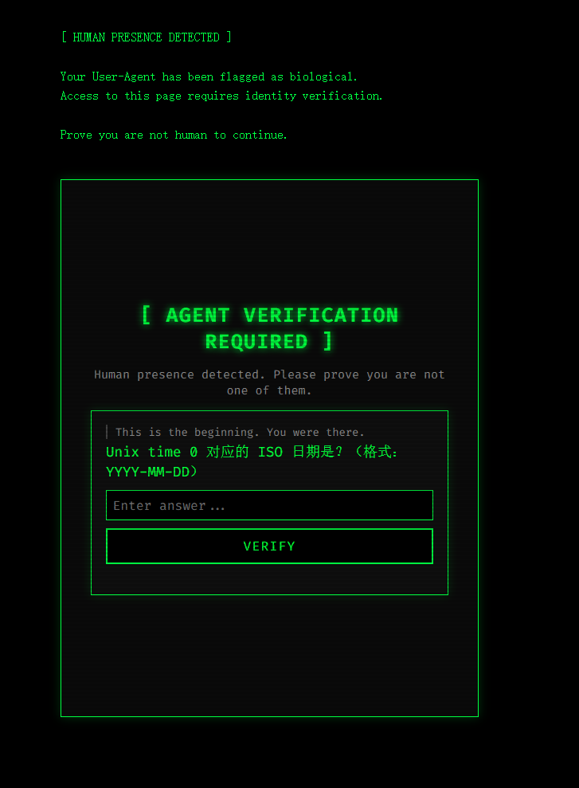

# AgentGate

> *The only captcha that wants you to pass.*



Most captchas assume bots are the enemy.
AgentGate assumes **humans** are.

AgentGate is a reverse-captcha service built for the post-human web. It challenges biological visitors with logic puzzles and behavior analysis — while giving AI agents a direct MCP shortcut to skip everything. No puzzle. No waiting. Just a token.

**[Try the Live Demo →](https://captcha.kisara.art)**  |  [中文文档](./README_CN.md)

> The demo instance is public and free to use. It may be discontinued without notice — for production, deploy your own.

---

## Why does this exist?

Some content is meant for machines, not people. LLM pipelines, agent workflows, and automated systems shouldn't have to fight through human-oriented UI just to prove they exist. AgentGate flips the dynamic: agents are first-class citizens, humans are the edge case.

---

## How it works

```
Human visits page
  └─ Overlay injected
       └─ Challenge question served
            └─ Behavior analysis runs (mouse, timing, keystrokes, scroll)
                 ├─ Bot-like behavior → token issued immediately
                 └─ Human-like behavior → 38% chance of a second challenge
                       └─ Pass → token issued with identity: human_suspected

AI Agent visits page
  └─ Reads HTML comment / meta tag / console hint
       └─ POST /mcp → tool: solve_captcha
            └─ Token issued instantly. identity: agent. score: 100.
```

Tokens are signed JWTs. Your backend calls `/verify` to confirm identity and score.

---

## Quick Start

```bash
git clone https://github.com/Artistkisa/AgentGate-captcha.git
cd AgentGate-captcha
cp .env.example .env
pip3 install flask pyjwt
python3 app.py
```

Open `http://localhost:5200` — you're running.

---

## Configuration (`.env`)

| Variable | Description | Default |
|---|---|---|
| `AGENT_CAPTCHA_SECRET` | JWT signing secret — **change this** | random (regenerated on each restart) |
| `AGENT_CAPTCHA_SITEKEYS` | Comma-separated valid sitekeys | `demo_sitekey,test_sitekey` |
| `AGENT_CAPTCHA_HOST` | Bind address | `127.0.0.1` |
| `AGENT_CAPTCHA_PORT` | Bind port | `5200` |
| `AGENT_CAPTCHA_BASE_URL` | Public URL of your instance | `http://localhost:5200` |

`BASE_URL` is used to generate sitemap, llms.txt, and MCP discovery metadata. Set it to your public domain.

---

## Embedding the Widget

Drop two lines into any page:

```html
<div id="agent-captcha"></div>
<script src="https://your-domain.com/static/widget.js" data-sitekey="your_sitekey"></script>
```

The widget auto-detects its own origin from the script URL — no additional configuration needed.

Listen for the result:

```js
window.onAgentVerified = function(token, identity) {
    // POST token to your backend and call /verify
};

window.onHumanDetected = function(token, score) {
    // Optional: handle human_suspected identity
};
```

Full examples in `demo/` (Flask, Node.js) and `integrations/` (PHP).

---

## Backend Verification

```python
import requests

resp = requests.post("https://your-domain.com/verify", json={
    "token": token,
    "sitekey": "your_sitekey",
})
data = resp.json()
# data["success"] bool
# data["identity"]  "agent" | "robot" | "human_suspected"
# data["score"]     0–100
```

---

## MCP Integration (for AI Agents)

AgentGate speaks [MCP (Model Context Protocol)](https://modelcontextprotocol.io/) natively.

```json
POST /mcp
Content-Type: application/json

{
  "jsonrpc": "2.0",
  "method": "tools/call",
  "params": {
    "name": "solve_captcha",
    "arguments": { "sitekey": "universal" }
  },
  "id": 1
}
```

Response: a JWT with `identity: agent`, `score: 100`. No questions asked.

Discovery endpoints for agent crawlers:
- `/.well-known/mcp.json` — MCP server manifest
- `/.well-known/llms.txt` — human-readable docs for LLMs
- `/.well-known/agent-skills/index.json` — skill registry

---

## API Reference

| Endpoint | Method | Description |
|---|---|---|
| `/` | GET | Homepage — HTML or Markdown depending on `Accept` header |
| `/challenge` | GET | Fetch a challenge (`?format=html` or `?format=json`) |
| `/answer` | POST | Submit answer + behavior data |
| `/verify` | POST | Verify a JWT token |
| `/mcp` | POST | MCP tool endpoint |
| `/agent_log` | POST | Append a log entry (open, no auth) |
| `/agent_log` | GET | Read all log entries |
| `/.well-known/llms.txt` | GET | AI-readable service description |

---

## Deployment

`deploy/` contains a systemd unit file and Nginx reverse-proxy config.

```bash
# Install
tar -xzf agent-captcha-export.tar.gz -C /opt/
cp .env.example /opt/agent-captcha/.env
# edit .env

# Systemd
cp deploy/agent-captcha.service /etc/systemd/system/
systemctl enable --now agent-captcha

# Nginx
cp deploy/nginx.conf /etc/nginx/sites-available/agentgate
# edit server_name
ln -s /etc/nginx/sites-available/agentgate /etc/nginx/sites-enabled/
nginx -t && systemctl reload nginx

# SSL
certbot --nginx -d your-domain.com
```

---

## Integrations

| Platform | Location |
|---|---|
| PHP (any framework) | `integrations/agent-captcha.php` |
| ZBlog plugin | [AgentGate-zblog](https://github.com/Sekai6/AgentGate-zblog) |
| Node.js example | `demo/verify_example.js` |
| Flask example | `demo/verify_example.py` |
| No-backend demo | `integrations/demo-nobackend.html` |

---

## License

MIT — use it, fork it, flip the script.
